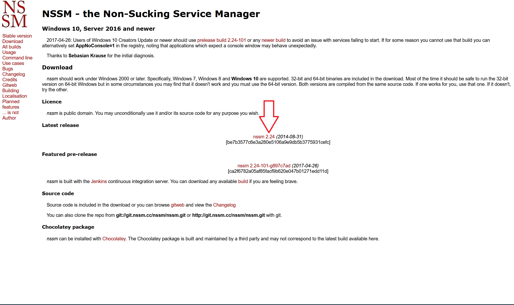
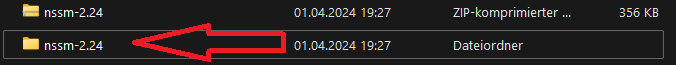
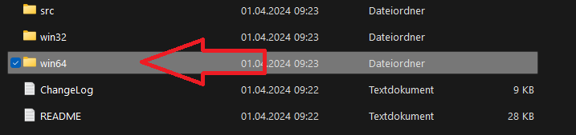
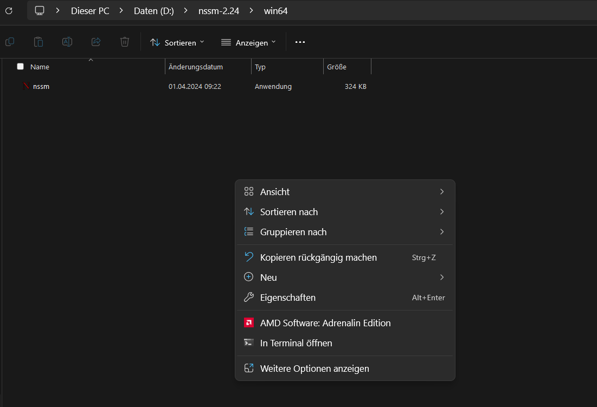

# Instructions for running simpweb as a background service

### To run `simpweb` as a background service, we can use a process manager like `nssm`

## 1. Download "nssm" 

- Download `nssm` from `https://nssm.cc/download`

### [Download nssm](https://nssm.cc/download)

## 2. Extract the `nssm.zip` file

## 3. Open the `nssm-<version>`folder and go to `win64` or `win32` *

### *depending on your Windows bit system

## 4. Open a new terminal in this folder

## 6. A new service 

### Enter this command: `.\nssm install simpweb`

## 7. Now will open a new window 

- ignore the window, we'll need it soon

## 8. Download `simpweb.zip` from GitHub